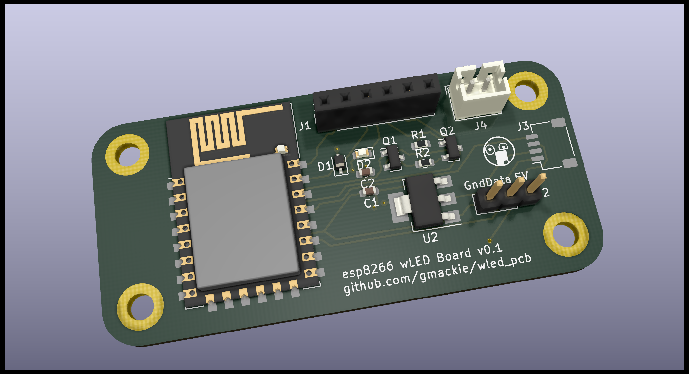

### wLED PCB
This is my first KiCAD project to try and make an esp8266 board to run
[wLED](https://github.com/Aircoookie/WLED)

PCB is being created at
[JLCPCB](https://jlcpcb.com/)

Eventually this will be posted somewhere with more details

